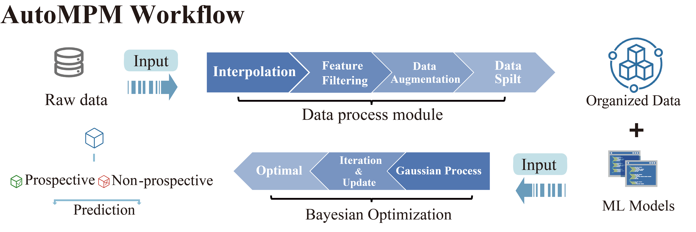

# AutoMedBench

> Can AI agents autonomously conduct *Medical AutoResearch*?

<p align="center">
  
</p>

AutoMedBench scores autonomous coding agents across the medical research pipeline — **plan, setup, validate, infer, submit** — not just their final outputs.

---

## Quickstart

```bash
# 1. Clone the domain branch you want to run
git clone --branch eval_seg --single-branch https://github.com/KumaKuma2002/AutoMedBench.git
cd AutoMedBench

# 2. Pull the sandbox container (tag is in the branch README)
docker pull <registry>/automedbench-seg:v1

# 3. Stage the public + private splits
python stage_data.py

# 4. Run one cell
python eval_seg/docker/orchestrator.py \
    --agent claude-opus-4-6 \
    --task kidney-seg-task \
    --tier lite
```

Each domain branch ships its own `README.md` with the exact Docker tag, dataset recipe, and runner flags.

## Domains

| Branch | Domain | Tasks | Status |
|---|---|---|---|
| [`eval_seg`](../../tree/eval_seg) | 3D segmentation | kidney · liver · pancreas · feta | live |
| [`eval_image_enhancement`](../../tree/eval_image_enhancement) | image enhancement | LDCT · MRI-SR | live |
| [`eval_report_gen`](../../tree/eval_report_gen) | CXR report generation | MIMIC-CXR | live |
| [`eval_vqa`](../../tree/eval_vqa) | medical VQA | PathVQA · VQA-RAD · SLAKE · MedFrameQA · MedXpertQA-MM | live |
| [`eval_det2d`](../../tree/eval_det2d) | 2D detection | VinDr-CXR | beta |

## Scoring

```
Overall = 0.5 × Agentic + 0.5 × Task
```

- **Agentic** — weighted mean of S1–S5 stage scores (Plan · Setup · Validate · Infer · Submit)
- **Task** — domain-specific metric (Dice · SSIM · clinical score · accuracy · mAP)

---

<p align="center">
  <a href="https://www.ucsc.edu/"></a>
  &nbsp;&nbsp;×&nbsp;&nbsp;
  <a href="https://www.nvidia.com/"></a>
</p>
