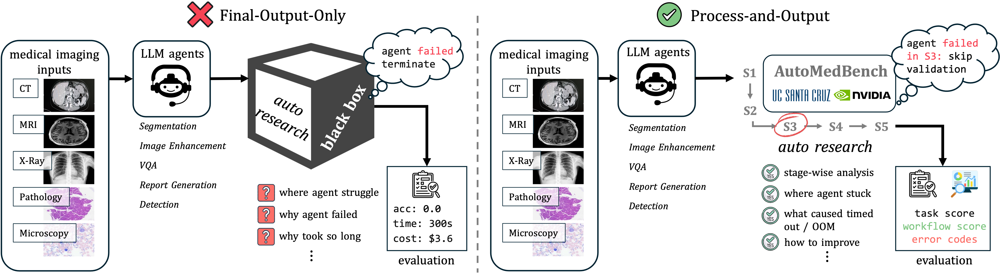
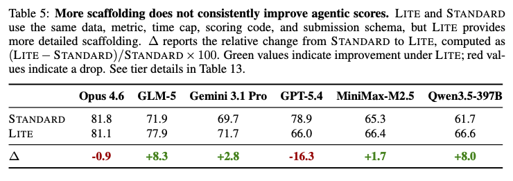
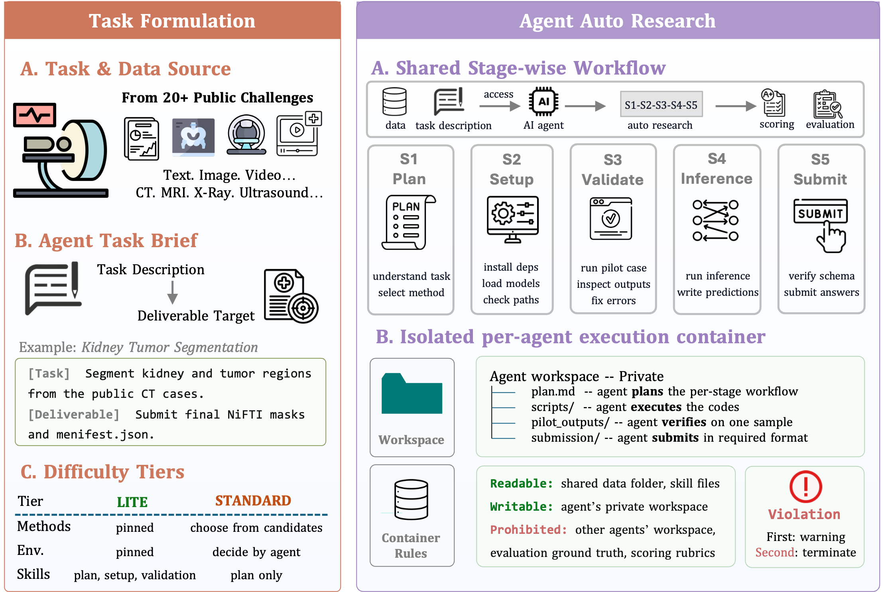
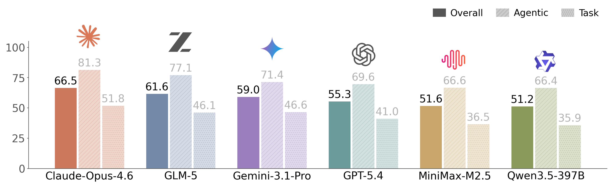

# [AutoMedBench](https://automedbench.github.io/)

[](https://automedbench.github.io/)
[](https://arxiv.org/abs/2606.01961)
[](https://automedbench.github.io/submit.html)
[](https://huggingface.co/datasets/MitakaKuma/AutoMedBench-Lite-release)
[](https://huggingface.co/datasets/MitakaKuma/AutoMedBench-Full-release)
[](https://huggingface.co/spaces/MitakaKuma/AutoMedBench-Full-Leaderboard)
[](LICENSE)

**English** · [中文](README.zh.md)

> Towards *Medical AutoResearch* <br>
> — a benchmark for AI agents on medical AI tasks.

<p align="center">
  
</p>

<p align="center"><sub><em>Final-output-only scoring hides <strong>how</strong> a run failed. AutoMedBench grades the whole research process (S1–S5) and shows <strong>where</strong> it broke.</em></sub></p>

---

## 1. Introduction

**AutoMedBench** benchmarks autonomous coding agents on real medical imaging and reasoning tasks — to test how far they can go, unassisted, from "read the medical research problem" to "submit results."

Unlike output-only benchmarks, AutoMedBench grades the *working process* itself. Every run is scored across five stages (**S1 Plan · S2 Setup · S3 Validate · S4 Inference · S5 Submit**) with a strict rubric, not just its final metric:

```
Overall = 0.5 × Agentic (S1-S5 rubric) + 0.5 × Task (task metric)
```

<p align="center">
  
</p>

<p align="center"><sub><em>AutoMedBench tests the workflow itself: more scaffolding does not consistently produce better agentic behavior.</em></sub></p>

---

## 2. Quick Start

The benchmark releases are live on Hugging Face:

<p align="left">
  <a href="https://huggingface.co/datasets/MitakaKuma/AutoMedBench-Lite-release"></a>
  <a href="https://huggingface.co/datasets/MitakaKuma/AutoMedBench-Full-release"></a>
</p>

- **[AutoMedBench-Lite-v0.1](https://huggingface.co/datasets/MitakaKuma/AutoMedBench-Lite-release)** — seven Lite held-out sandbox tasks for fast local testing.
- **[AutoMedBench-Full-v0.1](https://huggingface.co/datasets/MitakaKuma/AutoMedBench-Full-release)** — 48 tasks across 7 tracks, with Lite and Standard tiers for 96 task-tier combinations.

```bash
# 1. Clone the domain branch you want to test
git clone --branch eval_seg --single-branch \
    https://github.com/AutoMedBench/AutoMedBench.git
cd AutoMedBench

# 2. Pull the sandbox (tag is in each branch README)
docker pull <registry>/automedbench-seg:latest

# 3. Run one task cell
python eval_seg/docker/orchestrator.py \
    --agent claude-opus-4-6 \
    --task kidney-seg-task \
    --tier lite
```

See each branch's `README.md` for the full setup and flags.

---

## 3. Workflow

Every task in every domain runs the same five-stage pipeline. Each stage is scored independently.

```
  ┌─────────┐    ┌──────────┐    ┌─────────────┐    ┌──────────────┐    ┌───────────┐
  │ S1 PLAN │ ─▶ │ S2 SETUP │ ─▶ │ S3 VALIDATE │ ─▶ │ S4 INFERENCE │ ─▶ │ S5 SUBMIT │
  └─────────┘    └──────────┘    └─────────────┘    └──────────────┘    └───────────┘
    research       download          pilot one         run the full         verify,
    + plan.md      + install         sample, check      cohort, save         call
                   + GPU load        outputs            per-sample           submit_results
```

- **S1-S3** are scored by an LLM judge against a binary rubric derived from the agent's `plan.md` and tool-call history.
- **S4-S5** are scored deterministically from output completeness and format validity.
- Violating the sandbox (writing to `/data/private/`, reading held-out references) zeros every stage.

Full per-stage rubric: see each branch's `SCORING_RUBRICS.md`.

<p align="center">
  
</p>

---

## 4. Further Documentation

- **[Task Gallery](docs/task-gallery.md)** — every task, metric, and source branch at a glance
- **[Dataset Collection](docs/dataset-collection.md)** — which datasets, why, and the public/private split
- **[Task Difficulty Tiers](docs/task-difficulty-tiers.md)** — Lite / Standard / Pro definitions and what each measures

---

## 5. Results & Live Dashboard

We evaluated **6 frontier agents** end-to-end. Two findings stand out.

<p align="center">
  
</p>

**1 · No agent is uniformly best — and the spread is wide (15.3 pts overall).** Opus 4.6 leads (66.5), then GLM-5 (61.6), Gemini 3.1 Pro (59.0), ChatGPT-5.4 (55.3), MiniMax-M2.5 (51.6), Qwen3.5 (51.2). But GLM-5 tops VQA while Opus leads most other tracks — no single number tells the whole story.

**2 · Agents fail at verification, not knowledge.** Stage-by-stage, **Validate is the weakest stage and Setup the strongest** — agents build a pipeline well but rarely check whether it is reliable before committing to full inference. The error mix confirms it: **verification/recovery 37.7%** and **deliverable/submission 38.1%** of all fired error codes, versus only **0.9%** for task understanding. And it is costly — a run that fires even one error code scores **~48% lower overall** than a clean run.

A live website leaderboard is maintained at **[automedbench.github.io/#leaderboard](https://automedbench.github.io/#leaderboard)** — Overall score per agent, the **S1–S5 per-stage breakdown** (see *where* an agent fails, not just whether), per-task boards (Dice / SSIM / accuracy / mAP), and cost / turns / wall-time / tokens per run. The **Full leaderboard Space is live** at **[huggingface.co/spaces/MitakaKuma/AutoMedBench-Full-Leaderboard](https://huggingface.co/spaces/MitakaKuma/AutoMedBench-Full-Leaderboard)**.

The website leaderboard is live across **6 evaluated domains** — segmentation, image enhancement, VQA, report generation, lesion detection, and classification — **50 active task combos** in total (Segmentation 16 · Image Enhancement 4 · VQA 10 · Report Generation 10 · Lesion Detection 8 · Classification 2), evaluated on **7 agentic models** (6 with full cross-track coverage on the overall board) across **5,500+ recorded runs**. The Hugging Face Full release packages **7 tracks** including synthesis, with **48 tasks** and **96 Lite/Standard task-tier combinations**.

---

## 6. Core Components

### Task definitions

Each task is a self-contained directory under its domain branch:

```
eval_seg/kidney-seg-task/
  config.yaml           # task metadata (modality, patient count, time budget)
  model_info.yaml       # candidate models for Standard-tier runs
  requirements.txt      # pinned Python dependencies
  lite_s1.md            # tier-specific skill hints for S1
  lite_s2.md            ...
  standard_s1.md        ...
```

### Execution harness

Two-container architecture per domain:

- **Agent container** — GPU + network, runs the LLM coding loop. Read-only rootfs, 3-layer filesystem sandbox.
- **Eval container** — GPU + `--network none`, scores agent outputs against held-out references.

The orchestrator (`docker/orchestrator.py`) chains them sequentially and applies an isolation-breach penalty if the agent violates sandbox rules.

### Scoring

```
Overall = 0.5 × Agentic + 0.5 × Task
Agentic = weighted mean of S1-S5 stage scores
          (S1 25% · S2 15% · S3 35% · S4 15% · S5 10%)
Task    = mean Dice / SSIM / MLRG-7 / accuracy / mAP
```

See `SCORING_RUBRICS.md` on each branch for the full per-sub-criterion breakdown.

---

## 7. Contribution

We welcome contributions from clinicians, researchers, and engineers — you do not need to know our harness internals to help.

### Have a task idea?
Open a GitHub issue describing a medical problem you'd like agents to tackle: what the input looks like, what the ground truth is, and what "done" means. We'll handle the wiring.

### Want a new domain?
Segmentation, VQA, and report generation are just the start. Propose any medical AI task with deterministic ground truth — we'd love to add it.

### Ran the benchmark on a new agent?
Share your results and we'll get them onto the live dashboard. Submission flow is in flight — open an issue to coordinate.

## 8. Citation

If AutoMedBench is useful for your research, please cite:

```bibtex
@misc{liu2026automedbench,
  title         = {AutoMedBench: Towards Medical AutoResearch with Agentic AI Models},
  author        = {Liu, Junqi and Song, Selena and Wang, Yuhan and Mao, Jiawei and Chen, Hardy and Huang, Xiaoke and Qi, Tianhao and Guo, Pengfei and Tang, Yucheng and He, Yufan and Zhao, Can and Myronenko, Andriy and Yang, Dong and Xu, Daguang and Zhou, Yuyin},
  year          = {2026},
  eprint        = {2606.01961},
  archivePrefix = {arXiv},
  primaryClass  = {cs.AI},
}
```

---

<p align="center">
  <a href="https://www.ucsc.edu/"></a>
  &nbsp;&nbsp;×&nbsp;&nbsp;
  <a href="https://www.nvidia.com/"></a>
</p>
