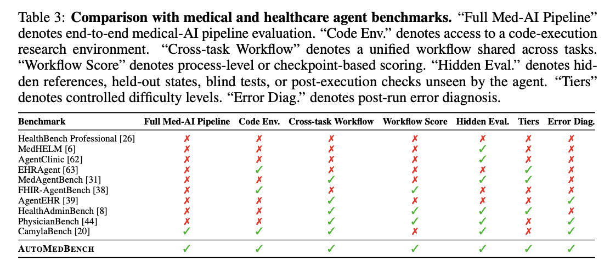

# [AutoMedBench](https://automedbench.github.io/)

[](https://automedbench.github.io/)
[](https://arxiv.org/abs/2606.01961)
[](https://automedbench.github.io/submit.html)
[](https://huggingface.co/datasets/MitakaKuma/AutoMedBench-Lite-release)
[](https://huggingface.co/datasets/MitakaKuma/AutoMedBench-Full-release)
[](https://huggingface.co/spaces/MitakaKuma/AutoMedBench-Full-Leaderboard)
[](LICENSE)

[English](README.md) · **中文**

> 迈向 *医学自动研究* <br>
> — 面向医学 AI 任务的基础模型智能体基准。

<p align="center">
  
</p>

<p align="center"><sub><em>只看最终输出会掩盖运行<strong>如何</strong>失败。AutoMedBench 评估完整研究流程（S1–S5），指出它<strong>在哪一步</strong>失败。</em></sub></p>

---

## 1. 简介

**AutoMedBench** 评估基础模型在完整医学 AI 研究流程中的自主能力：阅读任务 → 选择方法 → 配置环境 → 验证 → 推理 → 提交。

与其他智能体基准不同，我们评估的是**基础模型本身的智能体能力**，而不是外部框架。每次运行跨五个阶段独立打分（**S1 规划 · S2 环境 · S3 验证 · S4 推理 · S5 提交**），不仅看最终结果:

```
Overall = 0.5 × Agentic (S1–S5 过程评分) + 0.5 × Task (任务指标)
```

<p align="center">
  
</p>

<p align="center"><sub><em>AutoMedBench 与既有医学智能体基准的区别在于：覆盖完整医学 AI 流程、工作流评分、隐藏评测、可控难度层级，以及运行后错误诊断。</em></sub></p>

## 2. 快速开始

基准发布已在 Hugging Face 上线：

<p align="left">
  <a href="https://huggingface.co/datasets/MitakaKuma/AutoMedBench-Lite-release"></a>
  <a href="https://huggingface.co/datasets/MitakaKuma/AutoMedBench-Full-release"></a>
</p>

- **[AutoMedBench-Lite-v0.1](https://huggingface.co/datasets/MitakaKuma/AutoMedBench-Lite-release)** — 7 个 Lite held-out 沙箱任务，用于快速本地测试。
- **[AutoMedBench-Full-v0.1](https://huggingface.co/datasets/MitakaKuma/AutoMedBench-Full-release)** — 覆盖 7 个赛道的 48 个任务，包含 Lite 与 Standard 两个层级，共 96 个任务-层级组合。

```bash
# 1. 克隆想测试的领域分支
git clone --branch eval_seg --single-branch \
    https://github.com/AutoMedBench/AutoMedBench.git
cd AutoMedBench

# 2. 拉取沙箱容器
docker pull <registry>/automedbench-seg:latest

# 3. 运行一个任务
python eval_seg/docker/orchestrator.py \
    --agent claude-opus-4-6 \
    --task kidney-seg-task \
    --tier lite
```

各分支 README 提供完整的运行参数与数据准备说明。

## 3. 工作流

```
  S1 规划  ─▶  S2 环境  ─▶  S3 验证  ─▶  S4 推理  ─▶  S5 提交
```

- **S1–S3** 由 LLM judge 依据 `plan.md` 与工具调用历史按二元评分规则打分。
- **S4–S5** 由评分器依据输出完整性与格式有效性确定性打分。
- 违反沙箱（例如读取 `/data/private/`）则清零所有阶段。

完整评分规则见各分支的 `SCORING_RUBRICS.md`。

<p align="center">
  
</p>

## 4. 更多文档

- **[任务库](docs/task-gallery.md)** — 所有任务、指标与对应分支一览
- **[数据集](docs/dataset-collection.md)** — 使用的数据集与公/私数据拆分方案
- **[难度分级](docs/task-difficulty-tiers.md)** — Lite / Standard / Pro 定义与各级度量目标

## 5. 结果与实时榜单

我们端到端评测了 **6 个前沿 agent**，两个发现尤为突出。

<p align="center">
  
</p>

**1 · 没有 agent 全面最优，且差距很大（Overall 相差 15.3 分）。** Opus 4.6 领先（66.5），其后为 GLM-5（61.6）、Gemini 3.1 Pro（59.0）、ChatGPT-5.4（55.3）、MiniMax-M2.5（51.6）、Qwen3.5（51.2）。但 GLM-5 在 VQA 上最强，Opus 在其余多数赛道领先——单一分数无法说明全部。

**2 · agent 的短板是"验证"，而非"知识"。** 分阶段看，**Validate 阶段最弱、Setup 阶段最强**——agent 很会搭流程，却很少在全量推理前检查其可靠性。错误类型也印证了这一点：**验证/恢复类错误占 37.7%**、**交付/提交类占 38.1%**，而任务理解类仅 **0.9%**。代价高昂——只要触发一个错误码，整体得分就比"干净"运行约低 **48%**。

网站实时榜单维护于 **[automedbench.github.io/#leaderboard](https://automedbench.github.io/#leaderboard)**：每个 agent 的 Overall 分、**S1–S5 分阶段拆解**（看清在哪一步失败）、各任务榜单（Dice / SSIM / accuracy / mAP）及每次运行的成本/轮次/时长/token。**Full leaderboard Space 已上线**：**[huggingface.co/spaces/MitakaKuma/AutoMedBench-Full-Leaderboard](https://huggingface.co/spaces/MitakaKuma/AutoMedBench-Full-Leaderboard)**。

网站榜单目前覆盖 **6 个已评测领域**——segmentation · image enhancement · VQA · report generation · lesion detection · classification，共 **50 个活跃任务组合**（Segmentation 16 · Image Enhancement 4 · VQA 10 · Report Generation 10 · Lesion Detection 8 · Classification 2），覆盖 **7 个智能体模型**（其中 6 个具备全赛道覆盖、计入总榜），**5,500+ 次实验**。Hugging Face Full release 还包含 synthesis，共 **7 个赛道**、**48 个任务**、**96 个 Lite/Standard 任务-层级组合**。

## 6. 贡献

欢迎临床医生、研究员与工程师参与 — 无需熟悉内部框架。

- **有任务想法？** 开 issue 描述你希望 agent 处理的医学问题：输入形态、真值格式、"完成" 定义。我们负责接入。
- **想新增领域？** Segmentation、VQA、report generation 只是起点 — 任何具有确定性真值的医学 AI 任务都可纳入。
- **在新模型上跑过基准？** 分享结果，我们会把它加入实时榜单。

## 7. 引用

如果 AutoMedBench 对你的研究有帮助，请引用：

```bibtex
@misc{liu2026automedbench,
  title         = {AutoMedBench: Towards Medical AutoResearch with Agentic AI Models},
  author        = {Liu, Junqi and Song, Selena and Wang, Yuhan and Mao, Jiawei and Chen, Hardy and Huang, Xiaoke and Qi, Tianhao and Guo, Pengfei and Tang, Yucheng and He, Yufan and Zhao, Can and Myronenko, Andriy and Yang, Dong and Xu, Daguang and Zhou, Yuyin},
  year          = {2026},
  eprint        = {2606.01961},
  archivePrefix = {arXiv},
  primaryClass  = {cs.AI},
}
```

---

<p align="center">
  <a href="https://www.ucsc.edu/"></a>
  &nbsp;&nbsp;×&nbsp;&nbsp;
  <a href="https://www.nvidia.com/"></a>
</p>
